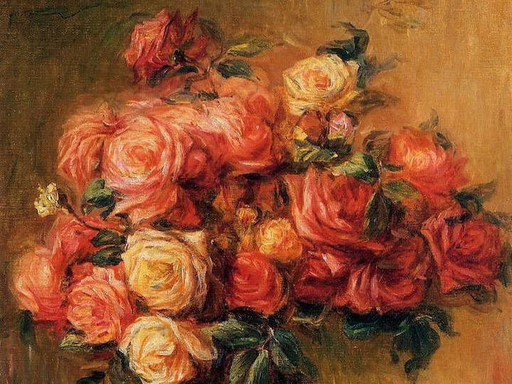
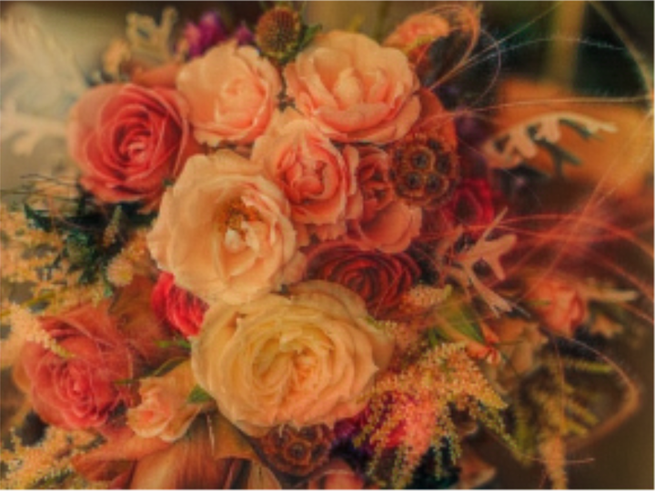
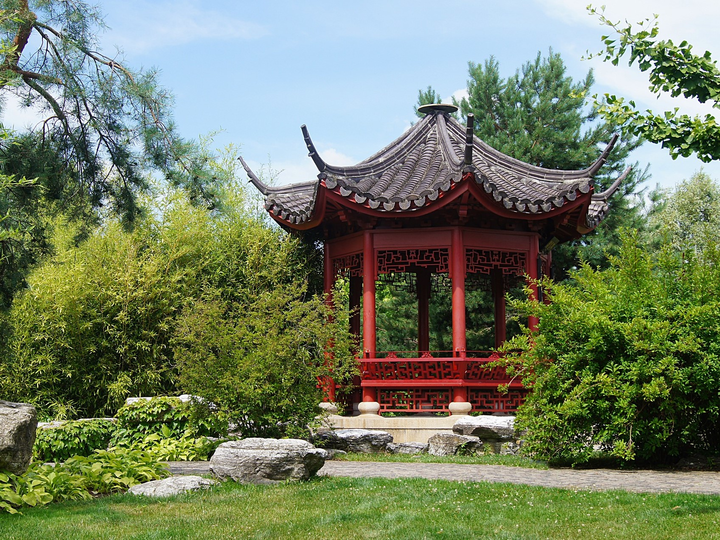
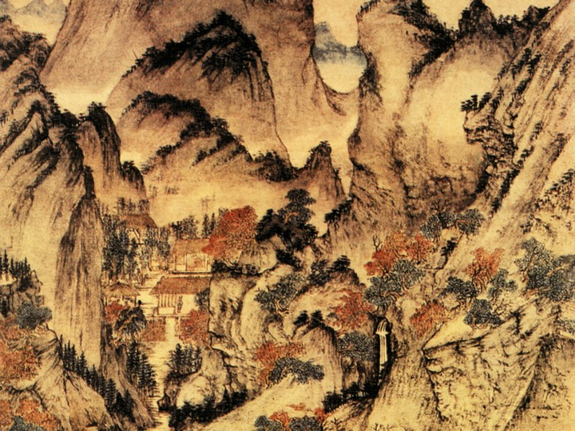
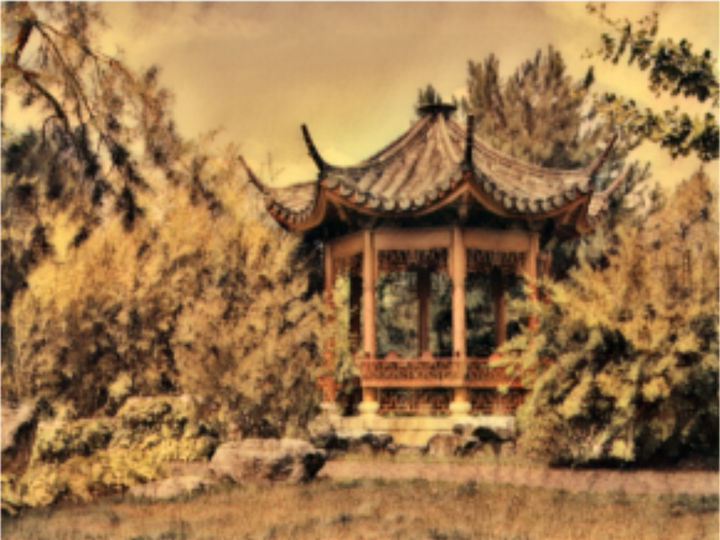
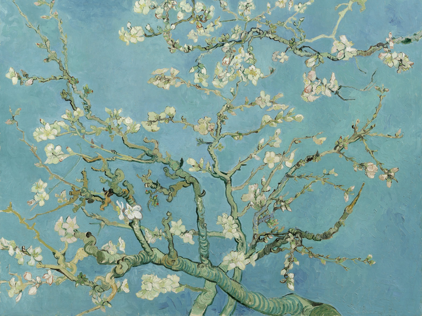
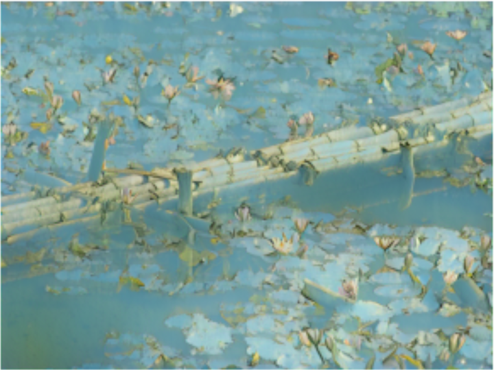

# Neural Style Transfer

This is a style transfer implementation for this [paper](https://arxiv.org/pdf/1508.06576v2.pdf) proposed by Leon A. Gatys, Alexander S. Ecker, and Matthias Bethge.

Utilizing the feature layers of the pre-trained VGG19 model, it would transform the base input image into a new image with input content and style. The model would try minimize a weighted content-style loss using LBFGS.

## Content

* `cnn_art_vgg19.ipynb`: this iPynb file contains all the necessary code.

* `/img_data`: this folder contains several photos and art works cropped to $720\times 540$.

* `/plots`: this folder stores some transformed photos.

* `/log`: this folder contains txt files of training logs.

## Analysis: Cases

For all three cases below, the model is configured with 700 steps of learning and a $1:500000$ content-stylizer loss ratio. The corresponding training output can be found in the `\log` folder.

### One very successful case

Here is a very successful case on bouquet: the photo is a bouquet of roses and the style image is an oil point by Renoir.

The similarity is that both images are bouquets of flowers, while the later is much warmer in color and emphasizes the light and shade on the petals. In this case, the model works beyond expectation.

| Content: photo of [rose bouquet](https://pixabay.com/images/id-691862/) | Style: Renoir’s [bouquet of roses](https://www.wikiart.org/en/pierre-auguste-renoir/bouquet-of-roses-1900) | Transferred: Impressionism |
| ------------------------------------------------------------ | ------------------------------------------------------------ | -------------------------- |
|                                     |                                      |      |

The 50-step losses are `run [50]: Style Loss : 0.000045 Content Loss: 13.822706 `.

The 700-step losses are `run [700]: Style Loss : 0.000001 Content Loss: 4.786065 `.

### Performance: low color contrast stylizer

This is another successful case using a landscape photo as base and a low color-contrast Chinese shan-shui painting by Wang Meng as the stylizer. 

The model successfully reproduces the color scheme of the painting: warm yellowish background color as if drawing on aged fabric, extreme dark shades for dense vegetations, and the artists’ characteristic brushstroke pattern.

| Content: photo of [pavilion](https://pixabay.com/images/id-975320/) | Style: Wang Meng’s [Ge-Zhi-Chuan Relocating](https://en.wikipedia.org/wiki/File:Ge_Zhichuan_Relocating_by_Wang_Meng.jpg) | Transferred: Ming Shan-Shui |
| ------------------------- | ------------------------ | --------------- |
|  |  |  |

The 50-step losses are `run [50]: Style Loss : 0.000048 Content Loss: 14.727825 `.

The 700-step losses are `run [700]: Style Loss : 0.000001 Content Loss: 6.077210 `.

### Performance: similar textures

Here is a special pair of content-stylizer that confuses the model. The content base is a photo of a small wooden dock inside a lily pond, and the stylizer is one of the famous almond blossoms by Van Gogh. Although we can easily identify the style of Van Gogh’s art work, the model cannot distinguish the difference between “wooden dock” texture and “tree branch” texture, producing weird stretch branches . Despite this major failure, the model does transfer the lilies to some van-Gogh style flowers and deemphasizes the “background” water pond and lotus leaves.

| Content: photo of [lily bridge](https://pixabay.com/images/id-3358844/) | Style: Van Gogh’s [almond blossom](https://artsandculture.google.com/asset/almond-blossom-vincent-van-gogh/dAFXSL9sZ1ulDw) | Transferred: Post-Impressionist and Japonism |
| ------------------------- | ------------------------ | --------------- |
|  |  |  |

The 50-step losses are `run [50]: Style Loss : 0.000070 Content Loss: 20.527573  `.

The 700-step losses are `run [700]: Style Loss : 0.000001 Content Loss: 9.541681`.